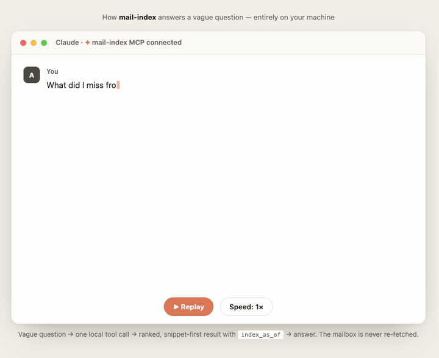
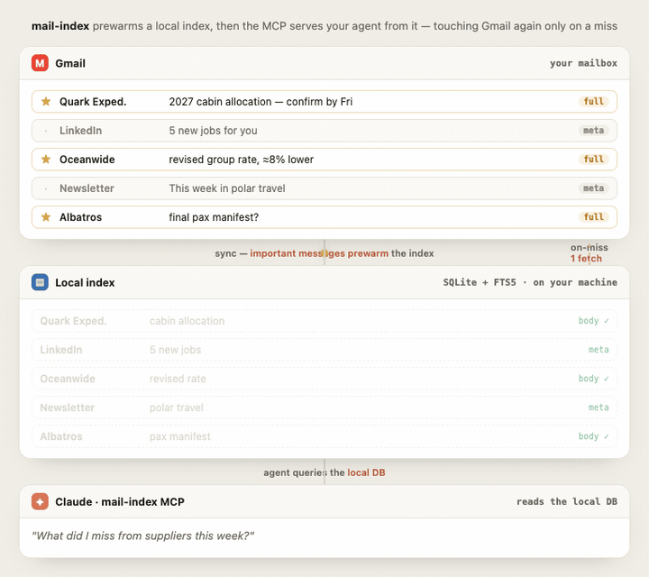

# mail-index

[](https://github.com/alunsoldantarctica/mail-index/actions/workflows/ci.yml)
[](LICENSE)


mail-index downloads a **preview of your whole inbox** to your machine, then
smartly fetches the full text of the messages that matter as you use it. That
local index lets your AI agent run **true summarization and recall over your
entire mailbox** — instead of being trapped behind Gmail's search bar.

It works through a **local MCP server**, so any agent (Claude, Codex, any MCP
client) can query it. Local-first — the index never leaves your machine.
Read-only — it never sends or mutates your mail.

<p align="center">
  <a href="docs/demo/mcp-demo.html">
    
  </a>
  <br />
  <sub>Ask a vague question → one local MCP call → ranked, snippet-first answer.
  <a href="docs/demo/mcp-demo.html">Interactive version →</a></sub>
</p>

> **Status: v1.0 core, building distribution.** Progressive sync, the
> correspondence graph, the interest engine, curation, the full 18-tool MCP
> surface, and the write-back loops are built and tested. Packaging — npm
> publish, the `.mcpb` bundle, and the one-click installers — is in progress, so
> today you install from source (below). Architecture lives in
> **[docs/PLAN.md](docs/PLAN.md)**; start with **[docs/INSTALL.md](docs/INSTALL.md)**.

---

## How it works

1. **Progressive sync** — metadata for the whole mailbox in minutes; bodies
   fetched selectively.
2. **Graph** — contacts, domains, threads; centrality + communities over your
   *human* (non-bulk) mail.
3. **Interest** — an engagement score per contact from read/reply/star/importance
   signals. A *seed for your curation*, not an autonomous decision.
4. **Curate** — you (via your agent, or a CLI wizard) confirm who/what matters;
   that profile drives which bodies get fetched.
5. **Query** — your agent searches, traverses the graph, and reads the messages
   that matter, all locally via MCP.

<p align="center">
  <a href="docs/demo/sync-flow.html">
    
  </a>
  <br />
  <sub>Important messages prewarm a local index; the MCP reads from it, touching
  Gmail again only when a needed body isn't there yet.
  <a href="docs/demo/sync-flow.html">Interactive version →</a></sub>
</p>

## Quick start

Requires **Node 24+** and a Gmail `MailSource` adapter — **`gog`** (recommended)
or **`gws`**. Reading Gmail needs a Google OAuth client, and you get one **two
ways**: use the **mail-index beta client** (skip Google Cloud entirely;
[request access](https://github.com/alunsoldantarctica/mail-index/issues/new?template=beta_access.yml)
to join the ~100-user test list) or **bring your own** Google Cloud client (no
cap, no request — we walk you through it). See
[docs/INSTALL.md §2](docs/INSTALL.md#2-connect-a-mailbox-pick-an-oauth-path)
and [docs/oauth-and-verification.md](docs/oauth-and-verification.md).

```sh
git clone https://github.com/alunsoldantarctica/mail-index.git
cd mail-index
pnpm install && pnpm build

mail-index init                              # scaffold the config
# …connect a mailbox (own OAuth client, read-only) — see docs/INSTALL.md §2 / agent-install.md…
node dist/cli/index.js sync  --account personal --since 6mo
node dist/cli/index.js graph build --account personal
node dist/cli/index.js search "that contract we discussed"
```
*(Once published to npm, `npm i -g mail-index` gives you the `mail-index` /
`mail-index-mcp` bins instead of `node dist/...`.)*

### Add to Claude

The MCP server registers in one step, but it still needs a mailbox connected
first (see the walkthrough). A `.mcpb`/`claude mcp add` only **adds the server** —
it doesn't install the adapter, sign you in, or sync.

- **Claude Code:** `claude mcp add --transport stdio mail-index -- mail-index-mcp`
  *(uses the `npx -y -p mail-index …` form once the package is published).*
- **Any MCP client (manual):**
  ```jsonc
  { "mcpServers": { "mail-index": { "command": "mail-index-mcp" } } }
  ```
- **Claude Desktop (planned):** a one-click `.mcpb` bundle + an all-in-one
  DMG/MSI installer (which *does* install the adapter, sign in, and sync) are in
  progress — there is no `claude://` install link.

Full walkthrough (auth, curation, enrichment, scheduled sync, desktop-app
gotchas) → **[docs/INSTALL.md](docs/INSTALL.md)**. Driving setup with an agent →
**[docs/agent-install.md](docs/agent-install.md)**.

## What to expect — time & storage

The index keeps metadata for every message and full text only where it earns it,
so it grows with message *count*, not mailbox size — about **1.5% of your Gmail**.
First sync runs ~50 messages/min (one-time, incremental after); search is instant.
Start with `--since 1mo` for value in minutes, then expand. Sizing table & growth
path → **[docs/INSTALL.md §9](docs/INSTALL.md#9-grow-your-index-intelligently)**.

## Why it's lighter than Gmail search

Stock Gmail-API MCPs are query-based **lookup** tools — exact query, a network
round-trip per call, raw payloads dumped into the model's context. mail-index
answers *vague* questions from a local **recall** index. Across a 100-question
suite on a real mailbox it answered every question for **15× fewer tokens** — and
the gap widens exactly where a query-based MCP has no primitive at all:
summarizing, relationships, and commitments.

<p align="center">
  <a href="docs/COMPARISON.md">
    
  </a>
</p>

Per-category tables, the read-one-message comparison, the tool-by-tool landscape,
and how to reproduce it all → **[docs/COMPARISON.md](docs/COMPARISON.md)**.

## Stack

TypeScript · `node:sqlite` (no native deps) · SQLite FTS5 · Graphology ·
`@modelcontextprotocol/sdk`. Node 24+. Pluggable `MailSource` adapters; ships two
Gmail transports — [`gog`](https://github.com/openclaw/gogcli) (recommended) and
Google's [`gws`](https://github.com/googleworkspace/cli).

## CLI

Two bins ship: `mail-index` (CLI) and `mail-index-mcp` (the stdio MCP server).

```
mail-index init                          Scaffold the operator config + data dir
mail-index sync    --account <a> [--since 30d|1mo] [--all] [--query <q>] [--limit N]
mail-index sync    --all-accounts        Sync every account by its policy presets
mail-index enrich  --account <a> [--profile | --rule direct|all] [--sender <s>] [--match <fts>] [--limit N]
mail-index graph   build [--account <a> | --all-accounts]
mail-index curate  [--account <a>]       Interactive curation wizard (no-agent fallback)
mail-index compact [--account <a>] [--now]   Demote summarized bulk bodies (ADR-0003)
mail-index search  <terms> [--account <a>] [--limit N] [--enrich]
mail-index show    <account:message-id>  Print a message (auto-enriches a meta row)
mail-index open    <account:message-id>  Print the provider web URL (no fetch)
mail-index status  [--json]              Per-account freshness + counts
```

## Documentation

- **[docs/INSTALL.md](docs/INSTALL.md)** — generic onboarding (install,
  authenticate a MailSource, init, sync, curate, enrich, add the MCP server,
  scheduled-sync snippet).
- **[docs/MCP.md](docs/MCP.md)** — the 18-tool MCP reference for agent
  integrators: args, compact result shapes, the `index_as_of` freshness +
  command-handback contracts.
- **[docs/ADAPTERS.md](docs/ADAPTERS.md)** — the `MailSource` contract and how to
  write + contract-test a new adapter.
- **[docs/PLAN.md](docs/PLAN.md)** — architecture, data model, and the key
  decisions (ADR digest).
- **[SECURITY.md](.github/SECURITY.md)** + **[docs/THREAT-MODEL.md](docs/THREAT-MODEL.md)**
  — privacy posture, trust boundaries, prompt-injection stance, and a
  "verify our claims yourself" runbook. The local-only promise is enforced in CI
  by an [egress guard test](test/egress-guard.test.ts).

## About

Built by **[Unsold Group](https://unsold.group/al)** — a travel & insurtech
company building the groundwork to operate as an AI-native business: local-first,
agent-native infrastructure that gives AI real, queryable context to work from.
mail-index is one piece of that — giving agents durable memory of a mailbox
without handing them the keys to it.

More: **[unsold.group/al](https://unsold.group/al)**

## Feedback & contact

There's **no telemetry** — we only know what you tell us, so feedback is
genuinely welcome:

- 💬 **[Discussions](https://github.com/alunsoldantarctica/mail-index/discussions)** — questions, ideas, how you use it
- 🐞 **[Report a bug](https://github.com/alunsoldantarctica/mail-index/issues/new?template=bug_report.yml)** · 💡 **[Request a feature](https://github.com/alunsoldantarctica/mail-index/issues/new?template=feature_request.yml)**
- 🔒 Security/privacy issues → **[SECURITY.md](.github/SECURITY.md)** (private)
- 🌐 **[unsold.group/al](https://unsold.group/al)**

Inside your agent you can also just say *"report a mail-index bug"* — the MCP
server points the agent to a GitHub link for you to submit (it never sends
anything itself). See **[SUPPORT.md](.github/SUPPORT.md)**.

## License

[MIT](LICENSE)
