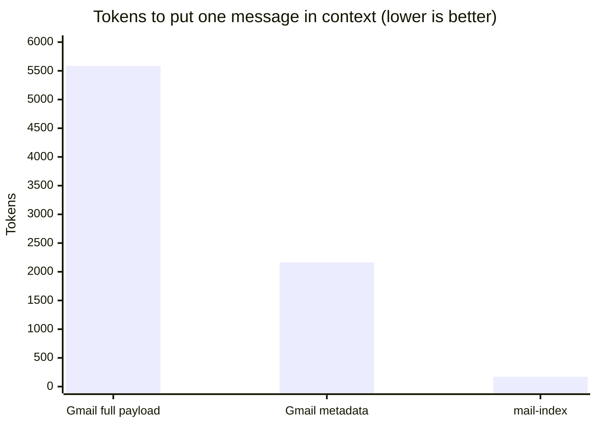
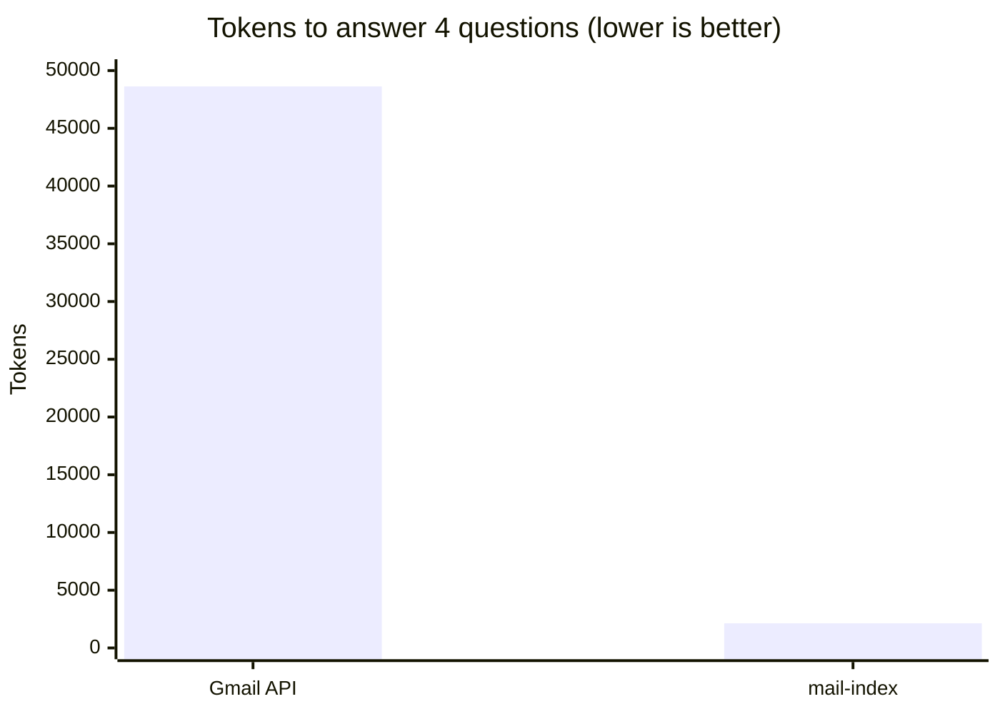

# mail-index

[](https://github.com/alunsoldantarctica/mail-index/actions/workflows/ci.yml)
[](LICENSE)


A **local, agent-queryable mail intelligence layer**. It indexes a mailbox
progressively (cheap metadata for everything, full bodies only where they earn
their place), builds a graph of who and what you correspond with, infers
interest from engagement signals, lets you curate who/what matters, and exposes
it all to AI agents (Claude, Codex, any MCP client) through a **local MCP
server**.

Local-first — the index never leaves your machine. Read-only — it never sends or
mutates your mail.

> **Status: v1.0.** Progressive sync, the correspondence graph, the interest
> engine, curation, the full 18-tool MCP surface, and the write-back loops are
> shipped. The full architecture and build plan live in
> **[docs/PLAN.md](docs/PLAN.md)**; start with **[docs/INSTALL.md](docs/INSTALL.md)**.

---

## The tool vs. your setup

This distinction shapes the whole project:

- **This repo is the *tool*** — generic, reusable, and contains **none** of any
  user's data. All examples use placeholders (`you@example.com`, `acct-a`).
- **Your *instance*** — the accounts you connect, your OAuth app, your curated
  interest profile, your agent instructions — is **private configuration you
  keep in your own dotfiles and data directory.** It is never committed here.

If a thing only makes sense for one person, it's configuration, not the tool.
See [docs/PLAN.md §2](docs/PLAN.md).

---

## How it works

1. **Progressive sync** — metadata for the whole mailbox in minutes; bodies
   fetched selectively.
2. **Graph** — contacts, domains, threads; centrality + communities over your
   *human* (non-bulk) mail.
3. **Interest** — an engagement score per contact from read/reply/star/importance
   signals. A *seed for your curation*, not an autonomous decision.
4. **Curate** — you (via your agent, or a CLI wizard) confirm who/what matters;
   that profile drives which bodies get fetched.
5. **Query** — your agent searches, traverses the graph, and reads the messages
   that matter, all locally via MCP.

## Quick start

Requires **Node 24+** and a `MailSource` (v1 ships the Gmail adapter via the
[`gws`](docs/INSTALL.md) CLI).

```sh
git clone https://github.com/alunsoldantarctica/mail-index.git
cd mail-index
pnpm install && pnpm build

mail-index init                              # scaffold ~/.config/mail-index/config.json
# …edit the config to point an account label at your gws config dir…
mail-index sync   --account acct-a --since 6mo
mail-index graph  build --account acct-a
mail-index search "that contract we discussed"
```

Then add the MCP server to your agent (Claude Desktop / Claude Code):

```jsonc
{ "mcpServers": { "mail-index": { "command": "mail-index-mcp" } } }
```

Full walkthrough (auth, curation, enrichment, scheduled sync, desktop-app
gotchas) → **[docs/INSTALL.md](docs/INSTALL.md)**.

## Why not just a Gmail MCP?

Stock Gmail-API MCPs are query-based **lookup** tools: you need the exact query,
every call is a network round-trip, and raw message payloads (header arrays +
base64 MIME parts) get streamed into the model's context. mail-index answers
*vague* questions from a local **recall** index — far lighter on tokens.

**Tokens to read one message** — a stock Gmail MCP hands the model the full API
payload; mail-index returns distilled, snippet-first text:



**Tokens to answer a 4-question recall suite** — Gmail must `list` (ids only)
then `get` each candidate just to *see* what it found; mail-index answers each in
one ranked, snippet-first call (measured on a real mailbox; reproduce below):



| | Gmail API (stock MCP) | mail-index | Savings |
|---|--:|--:|--:|
| Read one message | ~5,585 tok | ~171 tok | **~33×** |
| Recall (per question) | ~5,400–6,000 tok | ~550–640 tok | **~9–11×** |
| 4-question suite (total) | 48,630 tok | 2,136 tok | **22.8×** |
| Fixed schema tax (per turn) | ~1,367 tok (14 tools) | ~1,816 tok (18 tools) | −449 |

mail-index pays a slightly higher *fixed* schema tax (more, recall-focused
tools) and earns it back many times over on the **first question**. Full
write-up in **[docs/COMPARISON.md](docs/COMPARISON.md)**; reproduce/extend the
numbers with **[bench/](bench/README.md)** (`node bench/run.mjs`).

## Stack

TypeScript · `node:sqlite` (no native deps) · SQLite FTS5 · Graphology ·
`@modelcontextprotocol/sdk`. Node 24+. Pluggable `MailSource` adapters; v1 ships
the Gmail adapter (via the `gws` CLI).

## CLI

Two bins ship: `mail-index` (CLI) and `mail-index-mcp` (the stdio MCP server).

```
mail-index init                          Scaffold the operator config + data dir
mail-index sync    --account <a> [--since 30d|1mo] [--all] [--query <q>] [--limit N]
mail-index sync    --all-accounts        Sync every account by its policy presets
mail-index enrich  --account <a> [--profile | --rule direct|all] [--sender <s>] [--match <fts>] [--limit N]
mail-index graph   build [--account <a> | --all-accounts]
mail-index curate  [--account <a>]       Interactive curation wizard (no-agent fallback)
mail-index compact [--account <a>] [--now]   Demote summarized bulk bodies (ADR-0003)
mail-index search  <terms> [--account <a>] [--limit N] [--enrich]
mail-index show    <account:message-id>  Print a message (auto-enriches a meta row)
mail-index open    <account:message-id>  Print the provider web URL (no fetch)
mail-index status  [--json]              Per-account freshness + counts
```

## Documentation

- **[docs/INSTALL.md](docs/INSTALL.md)** — generic onboarding (install,
  authenticate a MailSource, init, sync, curate, enrich, add the MCP server,
  scheduled-sync snippet).
- **[docs/MCP.md](docs/MCP.md)** — the 18-tool MCP reference for agent
  integrators: args, compact result shapes, the `index_as_of` freshness +
  command-handback contracts.
- **[docs/ADAPTERS.md](docs/ADAPTERS.md)** — the `MailSource` contract and how to
  write + contract-test a new adapter.
- **[docs/PLAN.md](docs/PLAN.md)** — the full spec, data model, decisions (ADR
  digest), and roadmap.

## About

Built by **Al Ste-Marie** — a travel & insurtech founder. I build tools that lay
the groundwork for growing [**unsold.group**](https://unsold.group/al) into an
AI-native company: local-first, agent-native infrastructure that gives AI real,
queryable context to work from. mail-index is one piece of that — giving agents
durable memory of a mailbox without handing them the keys to it.

More: **[unsold.group/al](https://unsold.group/al)**

## License

[MIT](LICENSE) © Al Ste-Marie
