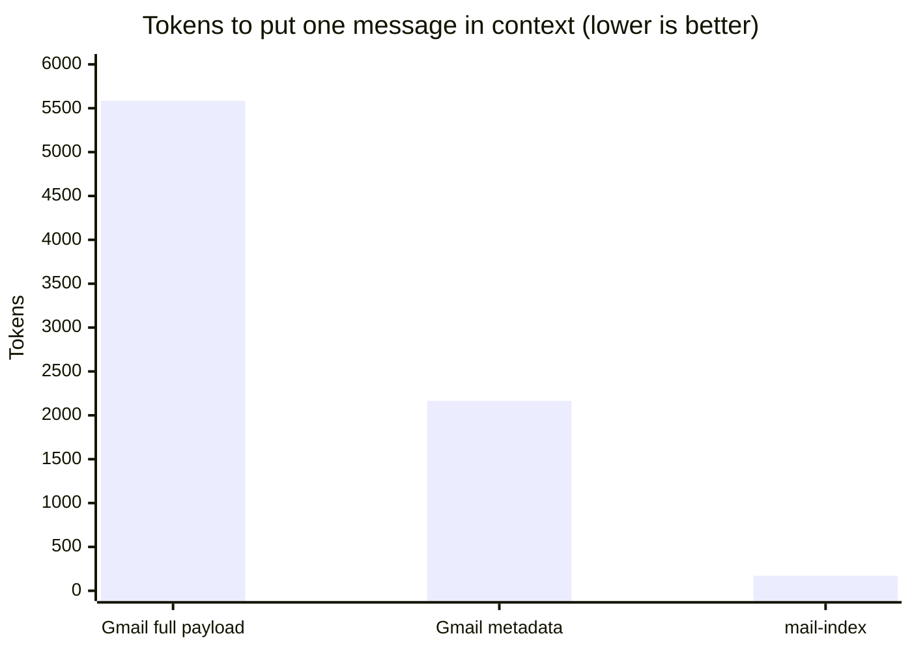
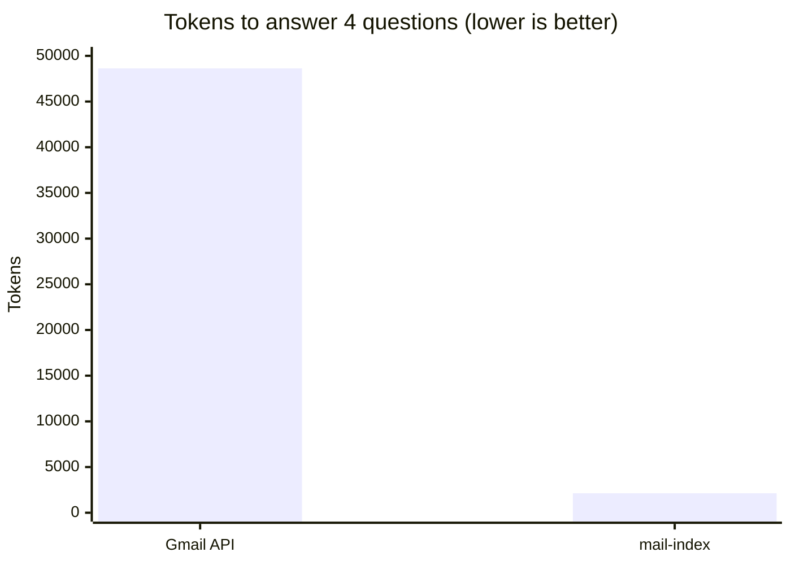
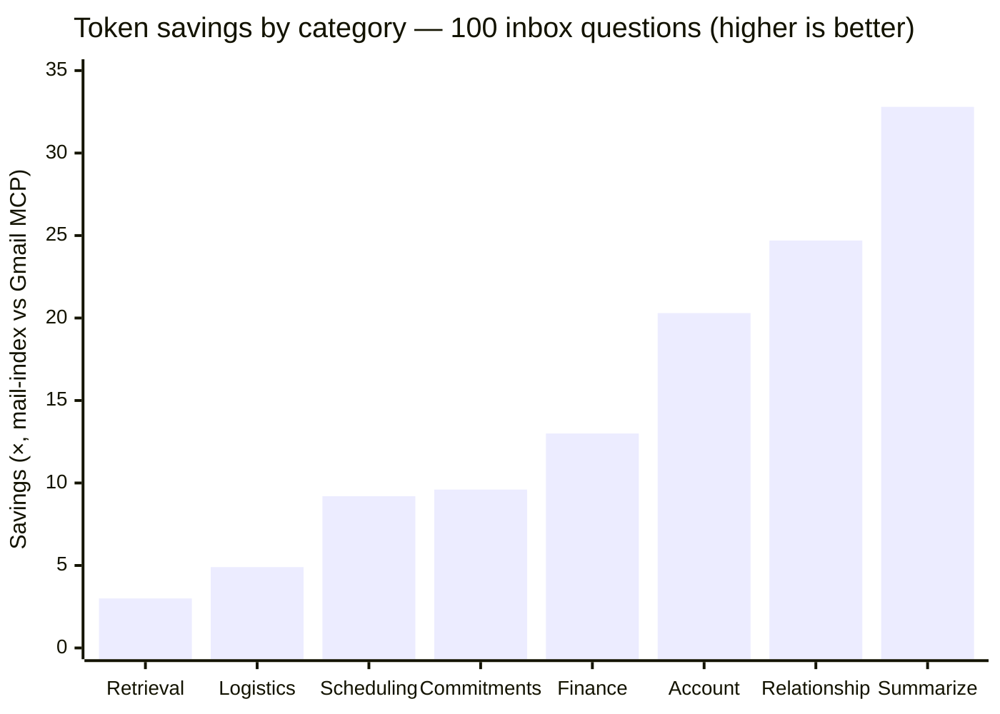

# mail-index

[](https://github.com/alunsoldantarctica/mail-index/actions/workflows/ci.yml)
[](LICENSE)


A **local, agent-queryable mail intelligence layer**. It indexes a mailbox
progressively (cheap metadata for everything, full bodies only where they earn
their place), builds a graph of who and what you correspond with, infers
interest from engagement signals, lets you curate who/what matters, and exposes
it all to AI agents (Claude, Codex, any MCP client) through a **local MCP
server**.

Local-first — the index never leaves your machine. Read-only — it never sends or
mutates your mail.

> **Status: v1.0.** Progressive sync, the correspondence graph, the interest
> engine, curation, the full 18-tool MCP surface, and the write-back loops are
> shipped. The full architecture and build plan live in
> **[docs/PLAN.md](docs/PLAN.md)**; start with **[docs/INSTALL.md](docs/INSTALL.md)**.

---

## The tool vs. your setup

This distinction shapes the whole project:

- **This repo is the *tool*** — generic, reusable, and contains **none** of any
  user's data. All examples use placeholders (`you@example.com`, `acct-a`).
- **Your *instance*** — the accounts you connect, your OAuth app, your curated
  interest profile, your agent instructions — is **private configuration you
  keep in your own dotfiles and data directory.** It is never committed here.

If a thing only makes sense for one person, it's configuration, not the tool.
See [docs/PLAN.md §2](docs/PLAN.md).

---

## How it works

1. **Progressive sync** — metadata for the whole mailbox in minutes; bodies
   fetched selectively.
2. **Graph** — contacts, domains, threads; centrality + communities over your
   *human* (non-bulk) mail.
3. **Interest** — an engagement score per contact from read/reply/star/importance
   signals. A *seed for your curation*, not an autonomous decision.
4. **Curate** — you (via your agent, or a CLI wizard) confirm who/what matters;
   that profile drives which bodies get fetched.
5. **Query** — your agent searches, traverses the graph, and reads the messages
   that matter, all locally via MCP.

## Quick start

Requires **Node 24+** and a `MailSource` (v1 ships the Gmail adapter via the
[`gws`](docs/INSTALL.md) CLI).

```sh
git clone https://github.com/alunsoldantarctica/mail-index.git
cd mail-index
pnpm install && pnpm build

mail-index init                              # scaffold ~/.config/mail-index/config.json
# …edit the config to point an account label at your gws config dir…
mail-index sync   --account acct-a --since 6mo
mail-index graph  build --account acct-a
mail-index search "that contract we discussed"
```

Then add the MCP server to your agent (Claude Desktop / Claude Code):

```jsonc
{ "mcpServers": { "mail-index": { "command": "mail-index-mcp" } } }
```

Full walkthrough (auth, curation, enrichment, scheduled sync, desktop-app
gotchas) → **[docs/INSTALL.md](docs/INSTALL.md)**.

## What to expect — time & storage

mail-index keeps **metadata for every message and full text only where it earns
it**, so the index is tiny next to your mailbox and grows with message *count*,
not mailbox size — a 5 MB email with attachments is still ~2 KB in the index.
(Measured on a real 6-month, ~8,000-message mailbox.)

| Your mailbox | Index size (metadata) | First sync (one-time) |
|---|--:|--:|
| 1,000 messages | ~1.6 MB | ~15–20 min |
| 10,000 messages | ~16 MB | run as a background job |
| ~1 GB of Gmail (~9–10k msgs) | ~16 MB (**~1.5%** of mailbox) | run as a background job |

Metadata sync runs **~50 messages/min** through the Gmail adapter (one provider
call per message — network-bound, one-time; incremental after). Searching the
local index is instant. Enriching a message's body later adds ~1–3 KB each, only
for the messages you choose. **Tip:** start with a recent window
(`--since 1mo`) for value in minutes, then expand — see
[Grow your index intelligently](docs/INSTALL.md#9-grow-your-index-intelligently).

## Why not just a Gmail MCP?

Stock Gmail-API MCPs are query-based **lookup** tools: you need the exact query,
every call is a network round-trip, and raw message payloads (header arrays +
base64 MIME parts) get streamed into the model's context. mail-index answers
*vague* questions from a local **recall** index — far lighter on tokens.

**Tokens to read one message** — a stock Gmail MCP hands the model the full API
payload; mail-index returns distilled, snippet-first text:



**Tokens to answer a 4-question recall suite** — Gmail must `list` (ids only)
then `get` each candidate just to *see* what it found; mail-index answers each in
one ranked, snippet-first call (measured on a real mailbox; reproduce below):



| | Gmail API (stock MCP) | mail-index | Savings |
|---|--:|--:|--:|
| Read one message | ~5,585 tok | ~171 tok | **~33×** |
| Recall (per question) | ~5,400–6,000 tok | ~550–640 tok | **~9–11×** |
| 4-question suite (total) | 48,630 tok | 2,136 tok | **22.8×** |
| Fixed schema tax (per turn) | ~1,367 tok (14 tools) | ~1,816 tok (18 tools) | −449 |

mail-index pays a slightly higher *fixed* schema tax (more, recall-focused
tools) and earns it back many times over on the **first question**.

And across a **30 common-use-case suite** on a real 6-month mailbox — the
questions an agent actually gets asked — answering them cost **19× fewer tokens**
overall:

| Category | Example | mail-index | Gmail MCP | Savings |
|---|---|--:|--:|--:|
| Aggregation | "list all supplier emails / invoices" | 337K | 5.5M | **16.5×** |
| Recall | "find the refund / recruiter message" | 5.7K | 55.9K | **9.8×** |
| Read | "read this message in full" | 1.2K | 68K | **54.8×** |
| Relational | "who do I email most" · "what did I miss" | 4.4K | 1.0M | **226.8×** |
| **Overall (30)** | | **348K** | **6.67M** | **19.2×** |

Relational questions are the tell: a query-based Gmail MCP has *no way* to answer
"who do I correspond with most" or "what did I miss" except by scanning the whole
mailbox — mail-index answers from precomputed structure in one call.

### 100 real inbox questions, by category

We also derived the **[top 100 questions people actually ask their inbox](docs/research/top-100-inbox-questions.md)**
from a multi-source research pass, encoded them as a runnable suite, and measured
the cost to answer each (`node bench/run.mjs --suite inbox100`). Answering all
100 cost **15.3× fewer tokens** overall — and the gap tracks exactly with how much
*synthesis* a question needs:



| Category (count) | mail-index | Gmail MCP | Savings |
|---|--:|--:|--:|
| Summarization & catch-up (12) | 35K | 1.13M | **32.8×** |
| Relationship & cross-thread (12) | 170K | 4.21M | **24.7×** |
| Account, security & replies (10) | 73K | 1.48M | **20.3×** |
| Finance, invoices & purchases (14) | 170K | 2.20M | **13.0×** |
| Commitments & follow-ups (12) | 140K | 1.34M | **9.6×** |
| Scheduling & appointments (8) | 27K | 250K | **9.2×** |
| Logistics, travel & deliveries (14) | 79K | 383K | **4.9×** |
| Retrieval & refinding (18) | 34K | 100K | **3.0×** |
| **Overall (100)** | **727K** | **11.1M** | **15.3×** |

The shape *is* the thesis: pure retrieval — the one thing Gmail search is built
for — is the narrowest gap (3.0×), while the **synthesis** categories (summarize,
relationship, commitments), where a query-based MCP has no primitive at all, are
where mail-index pulls 20–33× ahead.

Full write-up in **[docs/COMPARISON.md](docs/COMPARISON.md)** · 30-use-case table
in **[bench/RESULTS-USECASES.md](bench/RESULTS-USECASES.md)** · 100-question table
in **[bench/RESULTS-INBOX100.md](bench/RESULTS-INBOX100.md)** · the 100 questions
in **[docs/research/top-100-inbox-questions.md](docs/research/top-100-inbox-questions.md)**
· reproduce with **[bench/](bench/README.md)** (`node bench/run.mjs [--suite inbox100]`).

### How it compares to other tools

A scan of the ecosystem (June 2026) finds three adjacent categories, none of
which is what mail-index is:

- **Gmail/email MCP servers** (GongRzhe, navbuildz, gmail-mcp-local, the official
  Google MCP, StackOne/Composio) — email, but live-API *lookup*: exact queries,
  a round-trip per call, no local index or mailbox memory.
- **Local SQLite agent-memory engines** (AIngram, sqlite-memory, memweave,
  engram) — same FTS5/vector + MCP plumbing and local-first recall, but *generic*
  memory, not email-aware.
- **AI email clients** (Shortwave, Superhuman, Missive, Fyxer) — the same recall
  pitch, but closed end-user GUIs with their own backend, not something your own
  agents can query.

mail-index is the intersection the others miss: **email-specific + local
persistent index + agent-facing recall** (any MCP client, not one vendor's app).
Full landscape with links →
**[docs/COMPARISON.md#where-mail-index-sits-among-comparable-tools](docs/COMPARISON.md#where-mail-index-sits-among-comparable-tools)**.

**Know a tool we missed?** This landscape is meant to stay current, not to
flatter mail-index — [open an issue](https://github.com/alunsoldantarctica/mail-index/issues/new?title=Comparison%3A%20add%20%3Ctool%3E&body=Tool%3A%0AURL%3A%0ACategory%20%28Gmail%2Femail%20MCP%20%2F%20local%20agent-memory%20%2F%20AI%20email%20client%20%2F%20other%29%3A%0AWhat%20it%20does%20%2F%20how%20it%20compares%3A%0AEmail-specific%3F%20Local%20index%3F%20Agent-facing%20recall%3F%3A)
or PR to add a comparable tool (or correct how one is described).

## Stack

TypeScript · `node:sqlite` (no native deps) · SQLite FTS5 · Graphology ·
`@modelcontextprotocol/sdk`. Node 24+. Pluggable `MailSource` adapters; v1 ships
the Gmail adapter (via the `gws` CLI).

## CLI

Two bins ship: `mail-index` (CLI) and `mail-index-mcp` (the stdio MCP server).

```
mail-index init                          Scaffold the operator config + data dir
mail-index sync    --account <a> [--since 30d|1mo] [--all] [--query <q>] [--limit N]
mail-index sync    --all-accounts        Sync every account by its policy presets
mail-index enrich  --account <a> [--profile | --rule direct|all] [--sender <s>] [--match <fts>] [--limit N]
mail-index graph   build [--account <a> | --all-accounts]
mail-index curate  [--account <a>]       Interactive curation wizard (no-agent fallback)
mail-index compact [--account <a>] [--now]   Demote summarized bulk bodies (ADR-0003)
mail-index search  <terms> [--account <a>] [--limit N] [--enrich]
mail-index show    <account:message-id>  Print a message (auto-enriches a meta row)
mail-index open    <account:message-id>  Print the provider web URL (no fetch)
mail-index status  [--json]              Per-account freshness + counts
```

## Documentation

- **[docs/INSTALL.md](docs/INSTALL.md)** — generic onboarding (install,
  authenticate a MailSource, init, sync, curate, enrich, add the MCP server,
  scheduled-sync snippet).
- **[docs/MCP.md](docs/MCP.md)** — the 18-tool MCP reference for agent
  integrators: args, compact result shapes, the `index_as_of` freshness +
  command-handback contracts.
- **[docs/ADAPTERS.md](docs/ADAPTERS.md)** — the `MailSource` contract and how to
  write + contract-test a new adapter.
- **[docs/PLAN.md](docs/PLAN.md)** — architecture, data model, and the key
  decisions (ADR digest).
- **[SECURITY.md](SECURITY.md)** + **[docs/THREAT-MODEL.md](docs/THREAT-MODEL.md)**
  — privacy posture, trust boundaries, prompt-injection stance, and a
  "verify our claims yourself" runbook. The local-only promise is enforced in CI
  by an [egress guard test](test/egress-guard.test.ts).

## About

Built by **[Unsold Group](https://unsold.group/al)** — a travel & insurtech
company building the groundwork to operate as an AI-native business: local-first,
agent-native infrastructure that gives AI real, queryable context to work from.
mail-index is one piece of that — giving agents durable memory of a mailbox
without handing them the keys to it.

More: **[unsold.group/al](https://unsold.group/al)**

## Feedback & contact

There's **no telemetry** — we only know what you tell us, so feedback is
genuinely welcome:

- 💬 **[Discussions](https://github.com/alunsoldantarctica/mail-index/discussions)** — questions, ideas, how you use it
- 🐞 **[Report a bug](https://github.com/alunsoldantarctica/mail-index/issues/new?template=bug_report.yml)** · 💡 **[Request a feature](https://github.com/alunsoldantarctica/mail-index/issues/new?template=feature_request.yml)**
- 🔒 Security/privacy issues → **[SECURITY.md](SECURITY.md)** (private)
- 🌐 **[unsold.group/al](https://unsold.group/al)**

Inside your agent you can also just say *"report a mail-index bug"* — the MCP
server points the agent to a GitHub link for you to submit (it never sends
anything itself). See **[SUPPORT.md](SUPPORT.md)**.

## License

[MIT](LICENSE)
