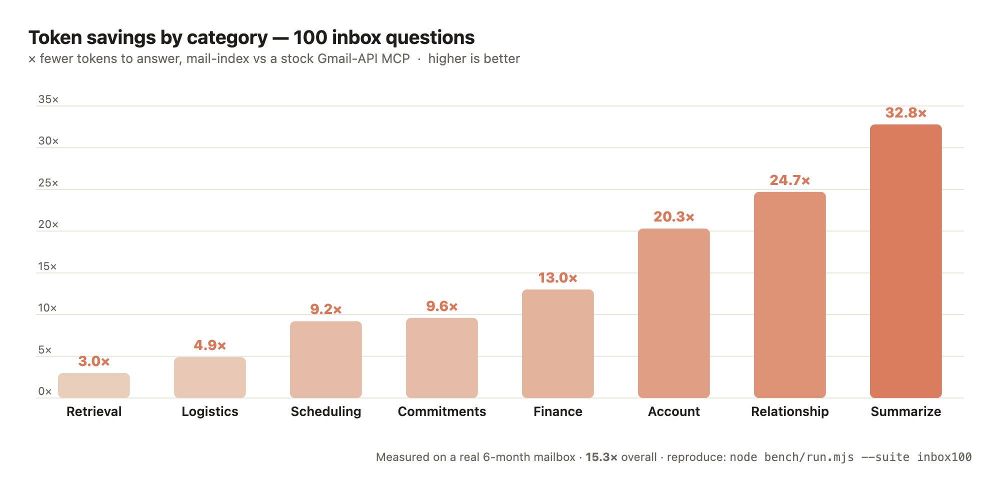

# How mail-index differs from a stock Gmail MCP — and why it's lighter

Most "Gmail for agents" MCPs are a thin wrapper over the Gmail REST API:
`search_emails` (Gmail query syntax), `read_email` (`messages.get`), plus
send/label/delete. They are **lookup tools**: the agent must already know the
exact query, every answer is a network round-trip, and the model pays for raw
message envelopes streamed into its context.

mail-index is a **recall tool** over a local index built for the way people
actually ask. That difference shows up as fewer tokens on both axes an MCP
server taxes: the fixed tool-schema cost paid every turn, and the per-question
result cost.

## The structural difference

| | Stock Gmail-API MCP | mail-index |
|---|---|---|
| Backing store | none — live API per call | local SQLite + FTS5 index |
| Find a message | exact Gmail query; `list` returns **ids only** | fuzzy ranked FTS; one call returns snippet rows |
| Vague question ("that rooftop thing") | 0 results or many query guesses | ranks the likely message first |
| Read a message | `messages.get?format=full` → full MIME (headers[], base64 parts) | distilled plain text / summary, snippet-first |
| Entity entry points | none (query only) | `find_person`, `list_contacts`, graph, **correspondents first** |
| Network per question | one+ round-trips, every time | none for recall; one bounded fetch only to read a still-unindexed body |
| "What did I miss" | not a primitive | `catch_up` / `digest_sources` composites |

## The token cost (measured against a real mailbox)

Reproduce with [`bench/`](../bench/README.md): `node bench/run.mjs`.

**Read one message** — the cleanest, most one-sided comparison:

| | Tokens to put one message in context |
|---|--:|
| Gmail `messages.get?format=full` (raw payload) | ~5,600 |
| Gmail `format=metadata` (headers only, still raw) | ~2,200 |
| mail-index `get_message` (distilled, snippet-first) | ~170 |

→ roughly **30× lighter** to read a message, because a raw Gmail payload is
base64 bodies, MIME parts, and a full header array — almost none of which the
model needs.

**Find something** — the round-trip tax:

| | Tokens to see 5 candidate results |
|---|--:|
| Gmail `messages.list` (ids only) → `get` each to read snippets | ~10,000+ |
| mail-index `search` (one ranked, snippet-first call) | ~550 |

→ Gmail's `list` returns no snippets, so the agent must fetch each candidate just
to *see what it is*. mail-index returns ranked snippets in a single call.

**Fixed schema tax** (injected every turn) — the one place mail-index costs
*more*, honestly: its 18 recall tools are ~1,800 schema tokens vs ~1,400 for a
stock Gmail MCP's 14 send/label/delete tools. That ~400-token premium buys the
recall surface (`find_person`, graph, curation, `catch_up`) — and it is repaid
on the **first question**, where the per-task savings are 9–80×.

**Measured aggregate** (4-task suite, real `personal` mailbox, `bench/run.mjs`):
per-task result tokens **2,136 (mail-index) vs 48,630 (Gmail API) — 22.8× less**
(recall tasks ~9–11×; reading one full message 80×+). Reproduce / extend the
suite yourself; numbers scale with mailbox content.

## 30 common use cases (measured on a real 6-month mailbox)

[`bench/run.mjs`](../bench/README.md) scores the tokens an agent's context pays
to **answer** 30 realistic questions, mail-index vs a stock Gmail-API MCP. Full
table: [`bench/RESULTS-USECASES.md`](../bench/RESULTS-USECASES.md).

| Category | Example | mail-index | Gmail MCP | Savings |
|---|---|--:|--:|--:|
| Aggregation (15) | "list all supplier emails / invoices / travel" | 337K | 5.5M | **16.5×** |
| Recall (10) | "find the refund / the recruiter message" | 5.7K | 55.9K | **9.8×** |
| Read (2) | "read this message in full" | 1.2K | 68K | **54.8×** |
| Relational (3) | "who do I correspond with most" · "what did I miss" | 4.4K | 1.0M | **226.8×** |
| **Overall (30)** | | **348K** | **6.67M** | **19.2×** |

Two things this makes concrete:

- **Aggregation scales against Gmail, not mail-index.** "List all X over 6 months"
  forces Gmail to fetch every match (`list` returns ids only); mail-index returns
  the ranked candidate set in one call. The gap grows with mailbox size.
- **Relational questions have no Gmail primitive.** "Who do I correspond with
  most" or "what did I miss this week" can't be expressed as a query — the agent
  must pull and aggregate the whole mailbox (~1M tokens here). mail-index answers
  from precomputed contact/engagement/thread structure in ~one compact call (227×).

(Counts are a tokenizer-stable `chars/4` approximation; the ratios hold under
exact Claude tokenization. Match counts cap at the Gmail API page size, so the
Gmail aggregation/relational figures *under*-count the real cost.)

## 100 real inbox questions, by category

We also derived the
[top 100 questions people actually ask their inbox](research/top-100-inbox-questions.md)
from a multi-source research pass, encoded them as a runnable suite, and measured
the cost to answer each (`node bench/run.mjs --suite inbox100`). Answering all
100 cost **15.3× fewer tokens** overall — and the gap tracks exactly with how much
*synthesis* a question needs:

| Category (count) | mail-index | Gmail MCP | Savings |
|---|--:|--:|--:|
| Summarization & catch-up (12) | 35K | 1.13M | **32.8×** |
| Relationship & cross-thread (12) | 170K | 4.21M | **24.7×** |
| Account, security & replies (10) | 73K | 1.48M | **20.3×** |
| Finance, invoices & purchases (14) | 170K | 2.20M | **13.0×** |
| Commitments & follow-ups (12) | 140K | 1.34M | **9.6×** |
| Scheduling & appointments (8) | 27K | 250K | **9.2×** |
| Logistics, travel & deliveries (14) | 79K | 383K | **4.9×** |
| Retrieval & refinding (18) | 34K | 100K | **3.0×** |
| **Overall (100)** | **727K** | **11.1M** | **15.3×** |

The shape *is* the thesis: pure retrieval — the one thing Gmail search is built
for — is the narrowest gap (3.0×), while the **synthesis** categories (summarize,
relationship, commitments), where a query-based MCP has no primitive at all, are
where mail-index pulls 20–33× ahead. Full table:
[`bench/RESULTS-INBOX100.md`](../bench/RESULTS-INBOX100.md).

## Accuracy: a smarter query doesn't save Gmail

Tokens aside — *can* a stock Gmail MCP even answer "list my purchases over 6
months" accurately? [`bench/accuracy.mjs`](../bench/README.md) runs a matrix of
Gmail query variants (simple → keyword → distilled → broad), scoring each on
**recall** (against a transaction-sender reference set) and **tokens to answer**,
versus one mail-index phrase. Full table: [`bench/RESULTS.md`](../bench/RESULTS.md).

Two results:

- **You can't reliably distill a better query up front.** A hand-tuned
  "distilled" query (phrase matches, `-unsubscribe`) scored *lower* recall than
  naive keywords — its precision constraints excluded real transactions. The
  agent is guessing terms blind, with no corpus to check against.
- **Recall and tokens rise together.** Gmail's only lever for higher recall is a
  broader query — which means reading more messages, and you *must* read them
  (a stock-trade "order filled" is not a purchase; only the body disambiguates).
  Accuracy is bought with tokens.

A single mail-index phrase returns a scannable, snippet-first candidate set in
one call (~20–25× fewer tokens), with recall comparable to a broad Gmail query —
and the remaining gap closes **for free**: mail-index retrieves by sender and
category (structure a keyword query can't touch) and iterates locally. On Gmail
accuracy costs tokens; on mail-index it costs structure.

## Why it's also faster (wall-clock, not just tokens)

- **No network on the hot path.** Recall hits a local SQLite index; a stock Gmail
  MCP makes a REST round-trip for every `search` and every `read`.
- **One call, not a dance.** Answering "what did the recruiter say?" is one
  `search` (or `find_person` → `get_message`), versus list → get → get … until
  the model spots the right message.
- **Bounded reads.** The only time mail-index touches the provider is a single
  `get_message` body fetch for a message that isn't enriched yet (ADR-0001);
  everything bulk is handed back as a CLI command, never blocking the agent.

The point isn't that the Gmail API is bad — it's that an *agent* shouldn't pay
context and latency to re-discover, re-fetch, and re-parse a mailbox on every
question. That's what an index is for.

## Where mail-index sits among comparable tools

A scan of the surrounding ecosystem (June 2026) turns up three adjacent
categories. None combines all three of mail-index's traits at once:
**(a) email-specific, (b) a local persistent index, and (c) agent-facing recall
rather than exact lookup.**

**1. Gmail / email MCP servers — same category, opposite design.**
The crowded bucket. Each wraps the *live* provider API and exposes actions to an
agent; they are query-based and exact (a miss returns nothing), with no
persistent local index and no cross-mailbox memory.

- [GongRzhe/Gmail-MCP-Server](https://github.com/GongRzhe/Gmail-MCP-Server) — the
  most popular; natural-language Gmail management in Claude Desktop, auto-auth.
- [navbuildz/gmail-mcp-server](https://github.com/navbuildz/gmail-mcp-server) —
  multi-account read/write/label/auto-unsubscribe.
- [alexpekach/gmail-mcp-local](https://github.com/alexpekach/gmail-mcp-local) —
  "local-first" only in the sense that the OAuth token stays in the OS keychain;
  it still hits the live API on every call, with no local index.
- [Email Agent MCP](https://mcpservers.org/servers/usejunior/email-agent-mcp),
  [marlinjai/email-mcp](https://mcpservers.org/servers/marlinjai/email-mcp)
  (Gmail/Outlook/iCloud/IMAP), the
  [official Google Gmail MCP](https://developers.google.com/workspace/gmail/api/guides/configure-mcp-server),
  and commercial connectors (StackOne, Composio, Improvado).

These are the tools the rest of this document benchmarks: lookup, not recall.

**2. Local SQLite agent-memory engines — same plumbing, different domain.**
FTS5 (often plus a vector index), local-first, MCP — but *generic* memory, not
email. Architecturally the nearest neighbors.

- [bozbuilds/AIngram](https://github.com/bozbuilds/AIngram) — one SQLite file,
  sqlite-vec + FTS5 + knowledge graph, MCP. The closest architectural twin.
- [sqliteai/sqlite-memory](https://github.com/sqliteai/sqlite-memory),
  [memweave](https://towardsdatascience.com/memweave-zero-infra-ai-agent-memory-with-markdown-and-sqlite-no-vector-database-required/),
  [engram](https://github.com/nanoflow-io/engram) — hybrid keyword + semantic
  recall over a local store.
- [Nylas "Email as Memory for AI Agents"](https://cli.nylas.com/guides/email-as-memory-for-ai-agents)
  — the closest *conceptual* match (email framed as agent memory), but
  cloud-API-backed, not a local index.

**3. AI email clients — overlapping promise, opposite shape.**
[Shortwave](https://www.shortwave.com/), Superhuman, Missive, and Fyxer sell
nearly mail-index's pitch — "find what we agreed with Acme about pricing,"
contextual recall before replying — but as closed end-user GUI products with
their own backend. None exposes an agent-facing local index for *your own*
agents to query.

**Takeaway.** The MCP bucket has email but is live/exact; the memory bucket is
local/recall but domain-generic; the clients have recall but are closed GUIs.
mail-index is the intersection: an email-specific, local, recall-first index
that an agent — any MCP client, not one vendor's app — queries directly.
AIngram (architecture) and Nylas's "email as memory" framing (concept) are the
two to watch as the gap narrows.

> **Know a tool we missed?** This landscape is meant to stay current, not to
> flatter mail-index. If you build or use a comparable tool — Gmail/email MCP,
> local agent-memory engine, AI email client, or something none of these
> buckets capture — please
> [open an issue](https://github.com/alunsoldantarctica/mail-index/issues/new?title=Comparison%3A%20add%20%3Ctool%3E&body=Tool%3A%0AURL%3A%0ACategory%20%28Gmail%2Femail%20MCP%20%2F%20local%20agent-memory%20%2F%20AI%20email%20client%20%2F%20other%29%3A%0AWhat%20it%20does%20%2F%20how%20it%20compares%3A%0AEmail-specific%3F%20Local%20index%3F%20Agent-facing%20recall%3F%3A)
> or a PR adding it here. Corrections to how an existing tool is described are
> just as welcome.
